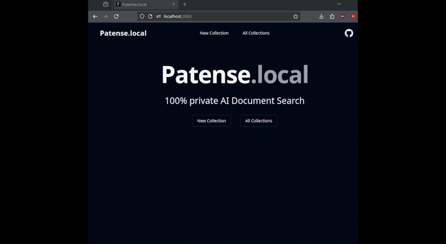

# Patense.local

A 100% local, private document search tool. It enables you to run deep, private searches across hundreds of pages per minute to get relevant context for your queries. Patense.local can run on any backend LLM server, using [text-gen-webui](https://github.com/oobabooga/text-generation-webui) by default.

It basically breaks your references up into pages, passes each page to an LLM with the query, and asks if the content is relevant to the query. If it's relevant, it displays a short quote with a link to the full page.

## Features
- **Deep document search** - find relevant portions of references fast with AI



- **Inventive feature extraction** - get all disclosed features for possible claims or amendments


## Keys

- **Privacy First**: Run the tool entirely on your local machine, ensuring full control over your data.
- **High Performance**: Search and analyze large documents quickly and efficiently.
- **Flexible Backend**: While `text-gen-webui` is the default, Patense.local can work with any backend LLM server.

## Requirements

- [vLLM](https://docs.vllm.ai/en/latest/index.html) (installation is outside the scope of this guide).
- **Node.js** and **npm** (These are necessary to run the application. If you're unfamiliar with installing them, it might be easier to use [Patense.ai](https://patense.ai)).

## Installation

1. **Clone the Repository**

   ```bash
   git clone https://github.com/JohnZolton/snorkle.git
   cd snorkle

2. **Install Dependencies**
   ```bash
   npm install
   ```

   2.1 Rename .env.example to .env


3. **Configure the Backend**
   
    Start your backend LLM server in api mode

   in your text-gen-webui folder (or other backend) run:
   ```bash
   vllm serve NousResearch/Meta-Llama-3.1-8B-Instruct --max-model-len 8000 --tensor-parallel-size 2 #Set to number of GPUs you're using


4. Initialize the database
   in the /patense-local folder, run:
   ```bash
   npm run db:push
5. Run the Application
   in the /patense-local folder, run:
   ```bash
   npm run dev
6. Naviage to http://localhost:3000

## Usage

Once the application is running, you can begin uploading documents and performing searches.
